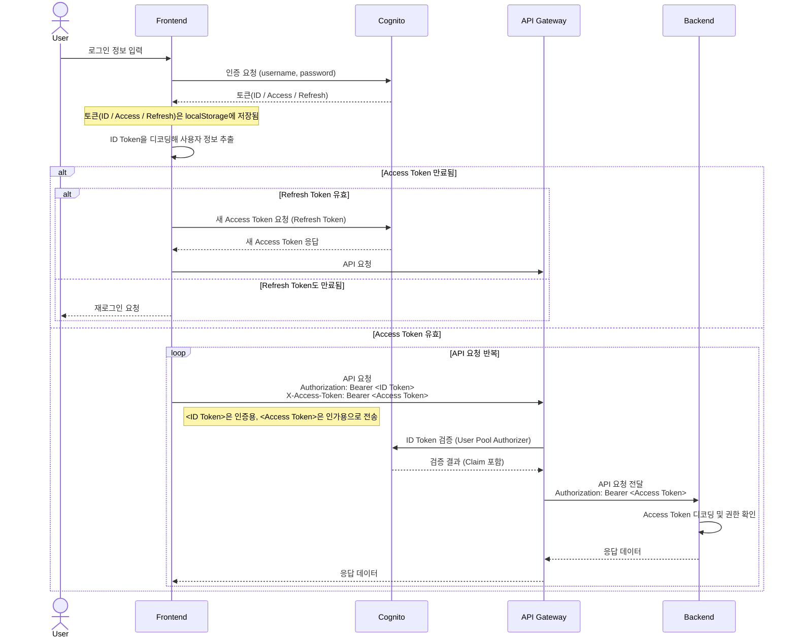
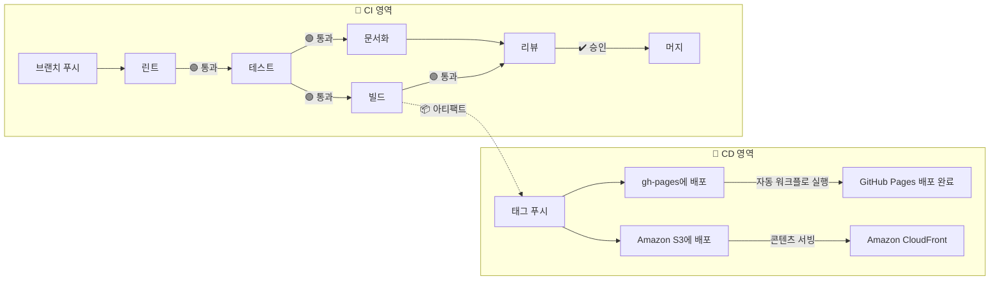

# 사용자 관리 마이크로 꾸러미 조각

> Single-Spa Parcel 구성

## 🚩 목차

-   [🛠️ 기술 스택](#️-기술-스택)
-   [💁 소개](#-소개)
-   [🎨 스크린샷](#-스크린샷)
-   [💡 주요 기능](#-주요-기능)
    -   [🔐 Amazon Cognito](#-amazon-cognito)
    -   [🗃️ 로컬 스토리지 저장](#️-로컬-스토리지-저장)
-   [📖 개발 문서](#-개발-문서)
    -   [📋 테스트 리포트](#-테스트-리포트)
    -   [📘 타입 문서](#-타입-문서)
-   [📐 다이어그램](#-다이어그램)
    -   [🧭 시퀀스 다이어그램](#-시퀀스-다이어그램)
    -   [🚚 CI/CD 파이프라인](#-cicd-파이프라인)
-   [📂 폴더 구조](#-폴더-구조)
-   [🚀 실행 방법](#-실행-방법)
    -   [💻 개발 서버 실행](#-개발-서버-실행)
    -   [🧬 Single-SPA 주입](#-single-spa-주입)
    -   [📜 유저스크립트](#-유저스크립트)

## 🛠️ 기술 스택

[](https://aws.amazon.com/ko/cognito/)  
[](https://single-spa.js.org/) [](https://greasyfork.org/ko)  
[](https://reactjs.org) [](https://tanstack.com/query/latest/docs/framework/react/overview) [](https://www.react-hook-form.com/) [](https://jotai.org/)  
[](https://www.chakra-ui.com/) [](https://axios-http.com/kr/docs/intro) [](https://github.com/jquense/yup)   
[](https://ko.vite.dev) [](https://rollupjs.org/) [![Terser](https://img.shields.io/badge/Terser-1E4A7A.svg?logo=data:image/svg+xml;base64,PHN2ZyB2ZXJzaW9uPSIxLjEiIHhtbG5zPSJodHRwOi8vd3d3LnczLm9yZy8yMDAwL3N2ZyIgd2lkdGg9IjUxMiIgaGVpZ2h0PSI1MTIiIHZpZXdCb3g9IjAgMCA1MTIgNTEyIj48Zz48cGF0aCBmaWxsPSIjZmZjODQzIiBkPSJNMjU2LDMyOWw2MywzNnYxMjhIMTkzVjM2NUwyNTYsMzI5eiBNMzE5LDE0N1YxOUgxOTN2MTI4bDYzLDM2TDMxOSwxNDd6Ii8+PHBhdGggZmlsbD0iI2ZmMzUwZiIgZD0iTTI1NiwxODNsNjMtMzZ2NzNMMjU2LDE4M3ogTTE5MywyOTJ2NzNsNjMtMzZMMTkzLDI5MnoiLz48cGF0aCBmaWxsPSIjZmY0MzM4IiBkPSJNMzE5LDIyMHYtNzNsMTEwLTY0bDYzLDEwOWwtMTExLDY0TDMxOSwyMjB6IE0xMzAsMjU2TDE5LDMyMGw2MywxMDlsMTExLTY0di03M0wxMzAsMjU2eiIvPjxwYXRoIGZpbGw9IiMwMDJmMzIiIGQ9Ik0zMTksMjIwbDYyLDM2bC02MiwzNlYyMjB6IE0xOTMsMjIwbC02MywzNmw2MywzNlYyMjB6Ii8+PHBhdGggZmlsbD0iIzAwYjNlMyIgZD0iTTE5MywyMjBsLTYzLDM2TDE5LDE5Mkw4Myw4M2wxMTAsNjRWMjIweiBNMzE5LDI5MnY3M2wxMTAsNjRsNjMtMTA5bC0xMTEtNjRMMzE5LDI5MnoiLz48cGF0aCBmaWxsPSIjMDA4YzNjIiBkPSJNMzE5LDI5MnY3M2wtNjMtMzZMMzE5LDI5MnogTTI1NiwxODNsLTYzLTM2djczTDI1NiwxODN6Ii8+PHBvbHlnb24gZmlsbD0iIzAwMjUwRCIgcG9pbnRzPSIyNTYsMTgzIDE5MywyMjAgMTkzLDI5MiAyNTYsMzI5IDMxOSwyOTIgMzE5LDIyMCIvPjwvZz48L3N2Zz4=&style=flat-square&logoColor)](https://terser.org/)  
[](https://eslint.org/) [![FSDSteiger](https://img.shields.io/badge/FSD_Steiger-211b1d.svg?logo=data:image/svg+xml;base64,PD94bWwgdmVyc2lvbj0iMS4wIiBlbmNvZGluZz0iVVRGLTgiPz4KPHN2ZyB2ZXJzaW9uPSIxLjEiIHhtbG5zPSJodHRwOi8vd3d3LnczLm9yZy8yMDAwL3N2ZyIgd2lkdGg9IjIwMCIgaGVpZ2h0PSIyMDAiPgo8cGF0aCBkPSJNMCAwIEMyOC4zOCAwIDU2Ljc2IDAgODYgMCBDODYgMy42MyA4NiA3LjI2IDg2IDExIEM1Ny42MiAxMSAyOS4yNCAxMSAwIDExIEMwIDcuMzcgMCAzLjc0IDAgMCBaICIgZmlsbD0iI0VCRUFFQSIgdHJhbnNmb3JtPSJ0cmFuc2xhdGUoNTcsMTAyKSIvPgo8cGF0aCBkPSJNMCAwIEMyOC4zOCAwIDU2Ljc2IDAgODYgMCBDODYgMy42MyA4NiA3LjI2IDg2IDExIEM1Ny42MiAxMSAyOS4yNCAxMSAwIDExIEMwIDcuMzcgMCAzLjc0IDAgMCBaICIgZmlsbD0iI0VCRUFFQSIgdHJhbnNmb3JtPSJ0cmFuc2xhdGUoNTcsODcpIi8+CjxwYXRoIGQ9Ik0wIDAgQzI4LjM4IDAgNTYuNzYgMCA4NiAwIEM4NiAzLjYzIDg2IDcuMjYgODYgMTEgQzU3LjYyIDExIDI5LjI0IDExIDAgMTEgQzAgNy4zNyAwIDMuNzQgMCAwIFogIiBmaWxsPSIjRUJFQUVBIiB0cmFuc2Zvcm09InRyYW5zbGF0ZSg1Nyw1NykiLz4KPHBhdGggZD0iTTAgMCBDMjguMzggMCA1Ni43NiAwIDg2IDAgQzg2IDMuNjMgODYgNy4yNiA4NiAxMSBDNTcuNjIgMTEgMjkuMjQgMTEgMCAxMSBDMCA3LjM3IDAgMy43NCAwIDAgWiAiIGZpbGw9IiNFQkVBRUEiIHRyYW5zZm9ybT0idHJhbnNsYXRlKDU3LDQyKSIvPgo8cGF0aCBkPSJNMCAwIEMxMy41MyAwIDI3LjA2IDAgNDEgMCBDNDEgMy42MyA0MSA3LjI2IDQxIDExIEMyNy40NyAxMSAxMy45NCAxMSAwIDExIEMwIDcuMzcgMCAzLjc0IDAgMCBaICIgZmlsbD0iI0U5RThFOCIgdHJhbnNmb3JtPSJ0cmFuc2xhdGUoNTcsMTQ3KSIvPgo8cGF0aCBkPSJNMCAwIEMxMy41MyAwIDI3LjA2IDAgNDEgMCBDNDEgMy42MyA0MSA3LjI2IDQxIDExIEMyNy40NyAxMSAxMy45NCAxMSAwIDExIEMwIDcuMzcgMCAzLjc0IDAgMCBaICIgZmlsbD0iI0U5RThFOCIgdHJhbnNmb3JtPSJ0cmFuc2xhdGUoNTcsMTMyKSIvPgo8cGF0aCBkPSJNMCAwIEMxMy41MyAwIDI3LjA2IDAgNDEgMCBDNDEgMy42MyA0MSA3LjI2IDQxIDExIEMyNy40NyAxMSAxMy45NCAxMSAwIDExIEMwIDcuMzcgMCAzLjc0IDAgMCBaICIgZmlsbD0iI0U5RThFOCIgdHJhbnNmb3JtPSJ0cmFuc2xhdGUoNTcsMTE3KSIvPgo8cGF0aCBkPSJNMCAwIEMxMy41MyAwIDI3LjA2IDAgNDEgMCBDNDEgMy42MyA0MSA3LjI2IDQxIDExIEMyNy40NyAxMSAxMy45NCAxMSAwIDExIEMwIDcuMzcgMCAzLjc0IDAgMCBaICIgZmlsbD0iI0U5RThFOCIgdHJhbnNmb3JtPSJ0cmFuc2xhdGUoNTcsNzIpIi8+Cjwvc3ZnPgo=&style=flat-square&logoColor=black)](https://github.com/feature-sliced/steiger) [](https://prettier.io/) [](https://www.typescriptlang.org/)  
[](https://vitest.dev/) [](https://typedoc.org/) [](https://www.postman.com/)

## 💁 소개

이 애플리케이션은 *Amazon Cognito*를 이용해 사용자 회원가입, 로그인, 로그아웃 등의 인증 기능을 제공합니다.  
회원가입 시 이메일 인증을 통해 사용자를 확인하며, 로그인 후에는 액세스 토큰, 리프레시 토큰, ID 토큰을 로컬 스토리지에 저장하여 인증 상태를 유지합니다.  
안전하고 신뢰할 수 있는 사용자 인증 흐름을 제공합니다.

## 🎨 스크린샷

 

  


<br/>

## 💡 주요 기능

### 🔐 Amazon Cognito

> 웹 및 모바일 앱을 위한 자격 증명 플랫폼  
> 사용자 디렉터리, 인증 서버, OAuth 2.0 액세스 토큰 및 자격 증명에 대한 권한 부여 서비스

Cognito 사용자 풀 옵션

-   사용자 풀 로그인 옵션: 사용자 이름 (아이디)
-   가입 필수 옵션: 사용자 이름, 이메일

환경변수

```
VITE_COGNITO_USER_POOL_ID= # Cognito 사용자 풀 아이디
VITE_COGNITO_CLIENT_ID= # Cognito 앱클라이언트 아이디
```


### 🗃️ 로컬 스토리지 저장

-   **idToken**; 클라이언트에서 사용자 정보를 가져올 때 사용
-   **accessToken**; 백엔드 서비스에 접근할 때 사용
-   **refreshToken**; 두 토큰의 만료 시 갱신에 사용

<br/>

## 📖 개발 문서

### 📋 테스트 리포트

> 테스트 케이스 통과 여부 및 커버리지 현황 등을 시각적으로 제공합니다.  
> 이 테스트 리포트는 매 릴리즈 업데이트 시 자동으로 최신 상태로 배포됩니다.

&nbsp;&nbsp;&nbsp;&nbsp;&nbsp;&nbsp; <a href="https://daily1hour.github.io/PickMe-Auth-Parcel/test/report">  테스트 리포트 바로가기 </a>

<br/><br/>

### 📘 타입 문서

> 프로젝트에서 사용되는 타입 정의를 문서화한 자료입니다.  
> 이 타입 문서는 매 릴리즈 업데이트 시 자동으로 최신 상태로 배포됩니다.

&nbsp;&nbsp;&nbsp;&nbsp;&nbsp;&nbsp; <a href="https://daily1hour.github.io/PickMe-Auth-Parcel/docs">  타입 문서 바로가기 </a>

<br/><br/>

## 📐 다이어그램

### 🧭 시퀀스 다이어그램



<br/>

1.  **프론트엔드**는 Cognito SDK를 사용해 사용자 인증을 자체적으로 처리하고, 응답으로 받은 토큰을 저장한다.
2.  프론트엔드는 *ID Token*을 디코딩하여 사용자 정보를 활용한다.
3.  *Access Token*이 만료되면 *Refresh Token*으로 갱신하고, *Refresh Token*까지 만료되면 재로그인이 필요하다.
4.  API 요청을 하며 두 토큰을 하나의 요청에 각각 다른 헤더에 담아 전송된다.
    ```http
    Authorization: Bearer <ID Token>
    X-Access-Token: Bearer <Access Token>
    ```
5.  **API Gateway**는 Cognito User Pool **Authorizer**를 통해 *ID Token*으로 사용자를 인증(authentication)한다.
6.  API Gateway는 X-Access-Token을 Authorization 헤더로 덮어써서 백엔드로 전달한다.
7.  **백엔드**는 전달받은 *Access Token*을 디코딩되어 인가(authorization) 처리를 담당한다.

<br/>

### 🚚 CI/CD 파이프라인

&nbsp;&nbsp;&nbsp;&nbsp;&nbsp;&nbsp; <a href="https://github.com/Daily1Hour/PickMe-Auth-Parcel/actions" title="GitHub Actions">  GitHub Actions 바로가기 </a>



## 📂 폴더 구조

<details>
<summary>열기</summary>

> <image src="https://feature-sliced.design/kr/img/brand/logo-primary.png" width=40 />

```python
PickMe-Auth-Parcel
├─ src
│  ├─ main.tsx # 개발 서버 진입점
│  ├─ parcel.tsx # single-spa Parcel 빌드 진입점
│  ├─ app
│  │  └─ App.tsx # 프로바이더 스택
│  ├─ entities # 도메인 모델
│  │  └─ auth
│  │     ├─ index.ts
│  │     ├─ api
│  │     │  └─ dto.ts # dto 모델
│  │     ├─ config
│  │     │  └─ userPool.ts # Cognito 유저풀 정보 및 인스턴스
│  │     ├─ model # 모델 및 유효성 검사
│  │     │  ├─ index.ts
│  │     │  ├─ LoginCredential.ts
│  │     │  └─ SignupCredential.ts
│  │     ├─ repository # 브라우저 데이터 접근
│  │     │  └─ getLoggedIn.ts
│  │     └─ service # 유즈케이스
│  │        ├─ index.ts
│  │        ├─ login # 로그인
│  │        │  ├─ login.ts
│  │        │  │  ├─ login.test.ts
│  │        │  │  └─ login.usage.ts
│  │        │  ├─ forgotPassword.ts
│  │        │  │  ├─ forgotPassword.test.ts
│  │        │  │  └─ forgotPassword.usage.ts
│  │        │  └─ resetPassword.ts
│  │        ├─ session # 토큰 사용
│  │        │  ├─ getTokens.ts
│  │        │  │  ├─ getTokens.test.ts
│  │        │  │  └─ getTokens.usage.ts
│  │        │  └─ getUser.ts
│  │        └─ signup # 회원가입
│  │           ├─ signup.ts
│  │           │  ├─ signup.test.ts
│  │           │  └─ signup.usage.ts
│  │           └─ confirm.test.ts
│  │              └─ confirm.ts
│  ├─ features # 기능 구현체
│  │  ├─ authActions # 로그인/회원가입 기능
│  │  │  ├─ index.ts
│  │  │  ├─ api # 쿼리
│  │  │  │  ├─ index.ts
│  │  │  │  ├─ useLoginFetch.ts
│  │  │  │  ├─ useForgotPasswordFetch.ts
│  │  │  │  ├─ useResetPasswordFetch.ts
│  │  │  │  ├─ useSignupFetch.ts
│  │  │  │  └─ useConfirmFetch.ts
│  │  │  ├─ atom # 상태저장소
│  │  │  │  ├─ index.ts
│  │  │  │  └─ actionTypeAtom.ts
│  │  │  ├─ hook # 폼 커스텀훅
│  │  │  │  ├─ index.ts
│  │  │  │  ├─ useLoginForm.ts
│  │  │  │  ├─ useForgotPasswordForm.ts
│  │  │  │  ├─ useResetPasswordForm.ts
│  │  │  │  ├─ useSignupForm.ts
│  │  │  │  └─ useConfirmForm.ts
│  │  │  ├─ model # 스키마
│  │  │  │  ├─ index.ts
│  │  │  │  ├─ LoginSchema.ts
│  │  │  │  ├─ ForgotPasswordSchema.ts
│  │  │  │  ├─ ResetPasswordSchema.ts
│  │  │  │  ├─ SignupSchema.ts
│  │  │  │  └─ ConfirmSchema.ts
│  │  │  └─ ui
│  │  │     ├─ index.ts
│  │  │     ├─ forms
│  │  │     │  ├─ Field.tsx # 필드
│  │  │     │  ├─ Layout.tsx # 폼 레이아웃
│  │  │     │  ├─ LoginForm.tsx # 로그인 폼
│  │  │     │  ├─ ForgotPasswordForm.tsx # 비밀번호 찾기 폼
│  │  │     │  ├─ ResetPasswordForm.tsx # 비밀번호 리셋 폼
│  │  │     │  ├─ SocialLoginForm.tsx # 소셜로그인 폼
│  │  │     │  ├─ SignupForm.tsx # 회원가입 폼
│  │  │     │  └─ ConfirmForm.tsx # 회원가입 인증 폼
│  │  │     ├─ ActionLayout.tsx # 액션 레이아웃
│  │  │     └─ PopoverLayout.tsx # 팝오버 레이아웃
│  │  └─ userMenu # 로그인 인증 후 사용자메뉴 기능
│  │     ├─ index.ts
│  │     ├─ api
│  │     │  ├─ index.ts
│  │     │  ├─ useLoggedIn.ts
│  │     │  └─ useUserInfo.ts
│  │     └─ ui
│  │        └─ UserMenu.tsx
│  ├─ pages # 페이지
│  │  └─ auth
│  │     ├─ index.tsx
│  │     ├─ hook
│  │     │  └─ useTokens.ts
│  │     └─ ui
│  │        ├─ index.ts
│  │        ├─ AuthControls.tsx # 로그인/회원가입 컨트롤
│  │        └─ TokenInfo.tsx # 로그인 후 토큰 정보
│  ├─ shared # 공용
│  │  ├─ ActionType.ts
│  │  ├─ theme.ts
│  │  ├─ trans-ko.ts
│  │  ├─ styles
│  │  │  ├─ global.css
│  │  │  └─ index.js
│  │  └─ ui
│  │     ├─ atoms
│  │     │  ├─ index.ts
│  │     │  ├─ ButtonBackground.tsx
│  │     │  └─ StyledButton.tsx
│  │     ├─ index.ts
│  │     └─ molecules
│  │        ├─ index.ts
│  │        ├─ CircleButton.tsx
│  │        ├─ PrimaryButton.tsx
│  │        └─ SecondaryButton.tsx
│  ├─ third-party
│  │  └─ chakra-ui
│  └─ userscript # 유저스크립트
│     ├─ widget.meta.ts # 메타데이터
│     └─ widget.user.js # 스크립트
├─ tsconfig.json # ts 설정
│  ├─ tsconfig.app.json
│  ├─ tsconfig.node.json
│  └─ typedoc.json # 문서화 설정
├─ package.json # 의존성 설정
│  ├─ .prettierrc # 포맷터 설정
│  ├─ eslint.config.js # 린트 설정
│  └─ steiger.config.ts # FSD 린트 설정
└─ vite.config.ts # Vite 설정 파일
   └─ vite-env.d.ts # 환경변수 타입 정의
```

</details>
<br/>

## 🚀 실행 방법

### 💻 개발 서버 실행

```sh
$ npm install
$ npm run dev
```

### 🧬 Single-SPA 주입

1. 빌드
2. 배포 또는 프리뷰
3. 배포 주소를 parcelURL로 사용하여 다른 애플리케이션에 주입

#### 애플리케이션 빌드

```sh
$ npm install
$ npm run build
```

#### Parcel 컴포넌트 주입 방법

-   React

    ```ts
    import Parcel from "single-spa-react/parcel";

    export function myComponent(): React.ReactElement {
        const [parcelConfig, setParcelConfig] = useState<any>(null);

        useEffect(() => {
            const loadParcel = async () => {
                const { parcel: config } = await import(parcelURL);
                setParcelConfig(config);
            };
            loadParcel();
        }, []);

        return parcelConfig ? <Parcel config={parcelConfig} /> : <div>Loading...</div>;
    }
    ```

-   Vue

    ```ts
    <template>
      <Parcel
        :config="parcelConfig"
        :mountParcel="mountParcel"
      />
    </template>

    <script lang="ts">
    import Parcel from "single-spa-vue/parcel";
    import { mountRootParcel } from "single-spa";

    export default {
        components: { Parcel },
        data() {
            return {
                parcelConfig: import(parcelURL).then((module) => module.parcel),
                mountParcel: mountRootParcel,
            };
        },
    };
    </script>
    ```

-   Svelte

    ```ts
    <script lang="ts">
        import { onMount } from "svelte";
        import { mountRootParcel } from "single-spa";

        let container: HTMLDivElement;

        onMount(() => {
            let parcel: any;
            const loadParcel = async () => {
                const { parcel: parcelConfig } = await import(parcelURL);

                parcel = mountRootParcel(parcelConfig, {
                    domElement: container,
                });
            };
            loadParcel();

            return () => {
                if (parcel) {
                    parcel.unmount();
                }
            };
        });
    </script>

    <div bind:this={container}></div>
    ```

#### Parcel 유틸리티 함수 사용 방법

-   **getTokens 함수**  
    현재 로그인되어있는 사용자의 토큰 3종을 읽어옵니다.  
    이 기능은 동일 도메인에서 로그인되어 있어야 작동합니다.

    ```ts
    const { getTokens } = await import(parcelURL);

    const { idToken, accessToken, refreshToken } = await getTokens();
    ```

### 📜 유저스크립트

`@pickme/auth`를 위젯 형태로 페이지에 삽입하여,  
사용자 관리 애플리케이션을 페이지에 통합할 필요 없이 개발 페이지에서도 사용할 수 있도록 합니다.

1. 유저 스크립트 관리자 설치

    - Chrome: [Tampermonkey](https://chrome.google.com/webstore/detail/tampermonkey/dhdgffkkebhmkfjojejmpbldmpobfkfo), [Violentmonkey](https://chrome.google.com/webstore/detail/violent-monkey/jinjaccalgkegednnccohejagnlnfdag)
    - Firefox: [Greasemonkey](https://addons.mozilla.org/firefox/addon/greasemonkey/), [Tampermonkey](https://addons.mozilla.org/firefox/addon/tampermonkey/), [Violentmonkey](https://addons.mozilla.org/firefox/addon/violentmonkey/)
    - Safari: [Tampermonkey](http://tampermonkey.net/?browser=safari), [Userscripts](https://apps.apple.com/app/userscripts/id1463298887)
    - Microsoft Edge: [Tampermonkey](https://www.microsoft.com/store/p/tampermonkey/9nblggh5162s), [Violentmonkey](https://microsoftedge.microsoft.com/addons/detail/violentmonkey/eeagobfjdenkkddmbclomhiblgggliao)
    - Opera: [Tampermonkey](https://addons.opera.com/extensions/details/tampermonkey-beta/), [Violentmonkey](https://addons.opera.com/extensions/details/violent-monkey/)
    - Maxthon: [Violentmonkey](http://extension.maxthon.com/detail/index.php?view_id=1680)
    - AdGuard: (추가 소프트웨어가 필요하지 않습니다)

2. 스크립트 다운로드 (스크립트 관리자를 설치했으면 자동으로 감지합니다.)

    [](https://daily1hour.github.io/PickMe-Auth-Parcel/widget.user.js)

3. 개발 서버로 열린 `http://localhost` 도메인에서 자동으로 `@pickme/auth`가 페이지에 삽입됩니다.
